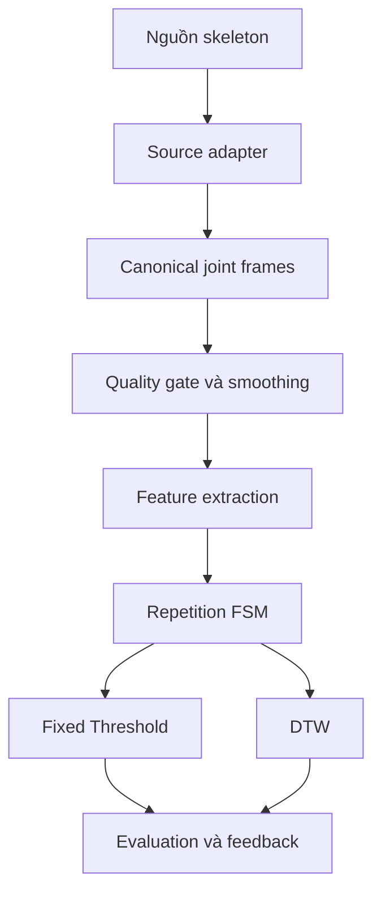
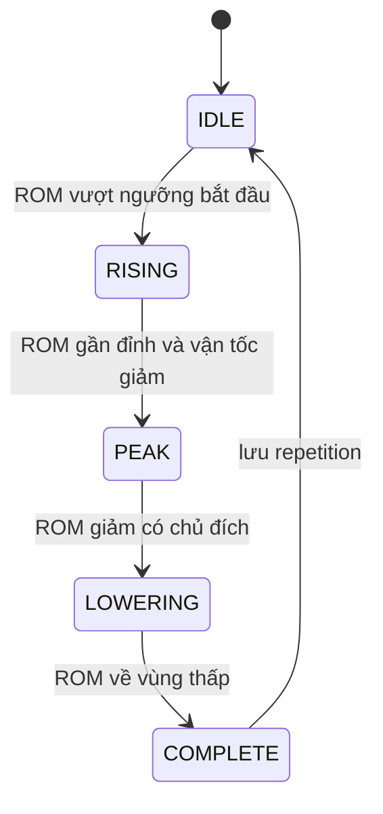
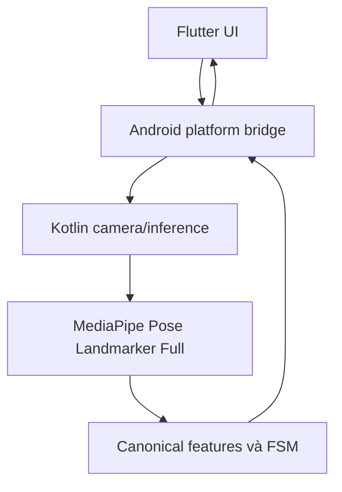

# AGENT PROJECT PLAN

## Phân tích và đánh giá bài tập Shoulder Abduction qua camera đơn mắt

Tài liệu này là nguồn định hướng cho AI coding agents và thành viên mới khi tiếp cận đồ án. Agent phải đọc toàn bộ file này trước khi phân tích yêu cầu, viết mã, sửa kiến trúc hoặc đề xuất thay đổi thuật toán.

---

## 1. Tóm tắt dự án trong một đoạn

Dự án xây dựng quy trình phân tích bài tập phục hồi chức năng **Standing Shoulder Abduction** bằng camera đơn mắt. Nghiên cứu dùng dữ liệu công khai UI-PRMD để xây dựng và so sánh hai baseline: **Fixed Threshold** và **Dynamic Time Warping (DTW)**. Hệ thống cần tiền xử lý dữ liệu khung xương, tính các đặc trưng vận động, tách từng lần lặp bằng finite-state machine, đánh giá chất lượng động tác và tích hợp phương pháp phù hợp vào một prototype Android chạy offline. Pose estimator mục tiêu trên thiết bị là **MediaPipe Pose Landmarker Full chính thức của Google**.

## 2. Nguồn yêu cầu và thứ tự ưu tiên

Agent phải xử lý mâu thuẫn theo thứ tự ưu tiên sau:

1. `DeCuongChiTiet_PhanTichBaiTapVaiQuaCamera(5).pdf`: nguồn chính về mục tiêu, phạm vi, đầu ra và tiến độ.
2. `1.  Nghiên cứu cách tính các giá trị cần thiết cho việc đánh giá bài tập Shoulder Abduction(2).pdf`: nguồn chính về công thức và các đặc trưng vận động.
3. File này: diễn giải hai tài liệu thành kế hoạch kỹ thuật và quy tắc làm việc cho Agent.
4. Tài liệu chính thức của MediaPipe và bài báo UI-PRMD.
5. Mã nguồn hiện tại, test và dữ liệu thực tế trong repository.

Nếu đề cương và báo cáo công thức khác nhau về phạm vi, ưu tiên đề cương. Cụ thể:

- MVP bắt buộc: ROM, nghiêng thân sang bên, gập khuỷu quá mức, repetition, Fixed Threshold và DTW.
- Nghiêng trước/sau, nhún vai và đưa tay ra trước là **phần nghiên cứu mở rộng**, không được làm chậm MVP.
- Không tự thêm bài tập khác, backend, tài khoản, dashboard, chatbot hoặc huấn luyện mô hình deep learning mới.

## 3. Mục tiêu sản phẩm và mục tiêu nghiên cứu

### 3.1. Mục tiêu nghiên cứu

- Xây dựng pipeline có thể tái lập cho bài `m07 - Standing Shoulder Abduction` của UI-PRMD.
- Tự động tách và đếm từng repetition.
- Xây dựng baseline Fixed Threshold có thể giải thích được.
- Xây dựng baseline DTW không yêu cầu hai chuỗi có cùng số frame hoặc cùng tốc độ.
- So sánh hai phương pháp trên cùng cách chia dữ liệu và cùng tiêu chí đánh giá.
- Phân tích trường hợp thất bại, không chỉ báo cáo một con số tổng hợp.

### 3.2. Mục tiêu sản phẩm

- Prototype Android hoạt động offline.
- Nhận hình ảnh/video, trích xuất pose landmarks, hiển thị skeleton.
- Đếm repetition và phản hồi sau mỗi lần lặp.
- Trạng thái phản hồi tối thiểu:
  - `correct`
  - `insufficient_rom`
  - `excessive_trunk_lean`
  - `excessive_elbow_flexion`
  - `insufficient_data`
- Không đưa ra chẩn đoán y khoa hoặc đề xuất phác đồ điều trị.

## 4. Những điều Agent tuyệt đối không được giả định

1. **Không xem UI-PRMD và MediaPipe là cùng một định dạng skeleton.** UI-PRMD được thu bằng Kinect/Vicon; MediaPipe trả về 33 landmarks. Phải dùng adapter để chuyển cả hai nguồn về schema ngữ nghĩa chung.
2. **Không so sánh trực tiếp tọa độ thô của UI-PRMD với MediaPipe bằng DTW.** Hãy ưu tiên chuỗi đặc trưng góc và các đại lượng đã chuẩn hóa.
3. **Không tự đặt ngưỡng lâm sàng rồi trình bày như kết luận khoa học.** Mọi threshold phải có nguồn, cách hiệu chỉnh và tập dữ liệu dùng để chọn ngưỡng.
4. **Không chia train/test theo frame ngẫu nhiên.** Việc này gây rò rỉ dữ liệu vì các frame của cùng người và cùng repetition rất giống nhau.
5. **Không dùng tập test để chọn threshold, mẫu DTW hoặc siêu tham số.**
6. **Không coi output MediaPipe là kết luận đúng/sai.** MediaPipe chỉ cung cấp landmarks; lớp đánh giá động tác phải được xây riêng.
7. **Không tuyên bố mobile demo đã được xác thực lâm sàng.** Dữ liệu nghiên cứu thuộc người khỏe mạnh và prototype chỉ hỗ trợ phản hồi kỹ thuật cơ bản.
8. **Không đưa toàn bộ frame ảnh từ Dart qua platform channel nếu có thể xử lý camera và inference ở native Android.** Cách đó gây sao chép bộ nhớ và giảm FPS.

## 5. Kiến trúc tổng thể



Hai nguồn skeleton:

- `UI-PRMD adapter`: dùng cho nghiên cứu, hiệu chỉnh, so sánh và báo cáo.
- `MediaPipe adapter`: dùng cho PC proof-of-concept và Android prototype.

Phần từ `Canonical joint frames` trở đi phải được thiết kế độc lập với nguồn pose. Công thức và logic nghiệp vụ không nên biết landmark đến từ Kinect, Vicon hay MediaPipe.

## 6. Ranh giới hệ thống

### Trong phạm vi Đồ án 1

- Một bài tập: Standing Shoulder Abduction.
- Một người trong khung hình.
- Một tay hoạt động tại một thời điểm.
- Camera đơn mắt, ưu tiên góc nhìn chính diện.
- Dữ liệu nghiên cứu: UI-PRMD.
- Fixed Threshold và DTW là hai baseline độc lập.
- Mobile Android offline.

### Ngoài phạm vi

- Chẩn đoán bệnh hoặc quyết định điều trị.
- Nhiều người đồng thời.
- Nhiều bài tập phục hồi chức năng.
- Cá nhân hóa theo ROM từng bệnh nhân.
- Huấn luyện lại pose estimator.
- Backend, tài khoản, đồng bộ cloud và lưu hồ sơ bệnh án.
- Khẳng định độ chính xác trên bệnh nhân thực tế.

## 7. Quy ước landmark

### 7.1. MediaPipe Pose Landmarker

Các landmark cần cho bài toán:

| ID | Landmark | Mức độ cần thiết |
|---:|---|---|
| 0 | Nose | Tùy chọn, nghiên cứu bù trừ đầu/cổ |
| 7 | Left ear | Tùy chọn, nghiên cứu bù trừ đầu/cổ |
| 8 | Right ear | Tùy chọn, nghiên cứu bù trừ đầu/cổ |
| 11 | Left shoulder | Bắt buộc |
| 12 | Right shoulder | Bắt buộc |
| 13 | Left elbow | Bắt buộc |
| 14 | Right elbow | Bắt buộc |
| 15 | Left wrist | Bắt buộc |
| 16 | Right wrist | Bắt buộc |
| 23 | Left hip | Bắt buộc |
| 24 | Right hip | Bắt buộc |

Quy ước `left` và `right` theo phía cơ thể người được quan sát, không theo phía màn hình. Việc lật preview chỉ là thao tác hiển thị và không được làm thay đổi nhãn giải phẫu.

MediaPipe cung cấp hai hệ tọa độ:

- `pose_landmarks`: `x`, `y` chuẩn hóa theo kích thước ảnh; `z` là độ sâu tương đối; có confidence như visibility/presence tùy API.
- `pose_world_landmarks`: tọa độ 3D ước lượng theo mét, gốc gần trung điểm hai hông.

Ưu tiên `world_landmarks` cho đặc trưng 3D nếu ổn định. Với đặc trưng trên mặt phẳng ảnh, dùng normalized landmarks. Không trộn hai hệ tọa độ trong cùng một phép tính.

### 7.2. UI-PRMD

Không hard-code chỉ số joint trước khi kiểm tra tài liệu metadata đi kèm dataset. Adapter phải ánh xạ tên/ID gốc sang các tên ngữ nghĩa:

- `left_shoulder`, `right_shoulder`
- `left_elbow`, `right_elbow`
- `left_wrist`, `right_wrist`
- `left_hip`, `right_hip`

Nếu nguồn dữ liệu không có joint đúng tên, Agent phải ghi lại quy tắc ánh xạ và kiểm tra bằng ít nhất một hình hoặc animation skeleton. Không âm thầm thay thế joint.

## 8. Schema dữ liệu chuẩn

### 8.1. Canonical landmark frame

Mọi adapter phải trả về cấu trúc tương đương:

```json
{
  "schema_version": 1,
  "source": "mediapipe|ui_prmd_kinect|ui_prmd_vicon",
  "sequence_id": "string",
  "subject_id": "string",
  "timestamp_ms": 0,
  "frame_index": 0,
  "active_side": "left|right|unknown",
  "coordinate_space": "normalized_image|world_m|dataset_native",
  "joints": {
    "left_shoulder": {"x": 0.0, "y": 0.0, "z": 0.0, "confidence": 1.0},
    "right_shoulder": {"x": 0.0, "y": 0.0, "z": 0.0, "confidence": 1.0},
    "left_elbow": {"x": 0.0, "y": 0.0, "z": 0.0, "confidence": 1.0},
    "right_elbow": {"x": 0.0, "y": 0.0, "z": 0.0, "confidence": 1.0},
    "left_wrist": {"x": 0.0, "y": 0.0, "z": 0.0, "confidence": 1.0},
    "right_wrist": {"x": 0.0, "y": 0.0, "z": 0.0, "confidence": 1.0},
    "left_hip": {"x": 0.0, "y": 0.0, "z": 0.0, "confidence": 1.0},
    "right_hip": {"x": 0.0, "y": 0.0, "z": 0.0, "confidence": 1.0}
  },
  "valid": true,
  "invalid_reason": null
}
```

### 8.2. Feature frame

```json
{
  "timestamp_ms": 0,
  "rom_deg": 0.0,
  "elbow_angle_deg": 180.0,
  "elbow_flexion_deg": 0.0,
  "trunk_lateral_deg": 0.0,
  "trunk_sagittal_deg": null,
  "shoulder_hike_deg": null,
  "forward_deviation_deg": null,
  "confidence": 1.0,
  "valid": true
}
```

Quy ước bắt buộc:

- `elbow_angle_deg = 180°` nghĩa là khuỷu duỗi thẳng.
- `elbow_flexion_deg = 180° - elbow_angle_deg`.
- Không dùng lẫn hai đại lượng này trong threshold.
- Giá trị không tính được phải là `null`/`NaN` kèm `valid=false`, không thay bằng `0`.

### 8.3. Repetition result

```json
{
  "rep_id": "string",
  "start_frame": 0,
  "peak_frame": 0,
  "end_frame": 0,
  "duration_ms": 0,
  "active_side": "left",
  "quality_ratio": 0.0,
  "features": {
    "peak_rom_deg": 0.0,
    "max_elbow_flexion_deg": 0.0,
    "max_abs_trunk_lateral_deg": 0.0
  },
  "fixed_threshold": {
    "labels": [],
    "valid": true
  },
  "dtw": {
    "normalized_distance": null,
    "label": null,
    "valid": false
  }
}
```

## 9. Tiền xử lý dữ liệu

Thứ tự xử lý chuẩn:

1. Đọc frame skeleton và metadata.
2. Xác định active side từ metadata; nếu không có, suy luận bằng biên độ ROM của hai bên và ghi lại cách suy luận.
3. Chuyển về canonical joint schema.
4. Kiểm tra joint bắt buộc và confidence.
5. Loại hoặc đánh dấu frame không hợp lệ.
6. Nội suy chỉ các khoảng thiếu ngắn; giới hạn độ dài khoảng nội suy phải nằm trong config.
7. Làm mượt tọa độ hoặc chuỗi đặc trưng bằng bộ lọc có tham số rõ ràng.
8. Tính feature frame.
9. Phân đoạn repetition.
10. Đánh giá từng repetition bằng hai baseline độc lập.

### 9.1. Quality gate

Một frame không đủ tin cậy nếu thiếu bất kỳ joint bắt buộc nào của bên hoạt động hoặc confidence thấp hơn ngưỡng cấu hình. Một repetition phải trả về `insufficient_data` nếu:

- Tỷ lệ frame hợp lệ dưới ngưỡng cấu hình.
- Thiếu vùng đầu, đỉnh hoặc cuối của chuyển động.
- Khoảng mất dấu liên tục dài hơn giới hạn cho phép.
- Không xác định được active side.

Không cố đưa ra kết luận đúng/sai khi dữ liệu không đủ.

### 9.2. Làm mượt

Baseline nên bắt đầu bằng một trong hai cách:

- Exponential Moving Average cho xử lý thời gian thực.
- Savitzky-Golay cho thí nghiệm offline.

Không chạy đồng thời nhiều bộ lọc mà không có ablation. Cấu hình bộ lọc phải được lưu cùng kết quả thực nghiệm.

### 9.3. Chuẩn hóa

- Với phép tính góc: ưu tiên vector vì góc không phụ thuộc tỷ lệ cơ thể.
- Nếu dùng khoảng cách: tịnh tiến theo `mid_hip` và chia theo shoulder width hoặc torso length.
- Không chuẩn hóa riêng từng repetition bằng thông tin làm mất biên độ ROM cần đánh giá.
- DTW phải dùng feature được chuẩn hóa theo thống kê của **training split**, sau đó áp dụng nguyên trạng cho validation/test.

## 10. Công thức đặc trưng

Mọi hàm góc phải:

- Chặn cosine về `[-1, 1]` trước khi `arccos`.
- Kiểm tra norm gần 0.
- Có unit test cho 0°, 90° và 180°.
- Ghi rõ dùng 2D hay 3D.

### 10.1. Range of Motion của vai

Với bên hoạt động:

```text
v_trunk = hip - shoulder
v_arm   = elbow - shoulder

ROM = degrees(arccos(
    dot(v_trunk, v_arm) / (norm(v_trunk) * norm(v_arm))
))
```

Ý nghĩa mong đợi:

- Tay thả dọc thân: gần `0°`.
- Tay dang ngang: gần `90°`.
- Tay hướng lên trên: tiến về `180°`.

Đây là kiểm tra hình học, không phải ngưỡng lâm sàng. Camera phải gần chính diện để ROM trên mặt phẳng ảnh có ý nghĩa.

### 10.2. Góc khuỷu tay

```text
v_upper   = shoulder - elbow
v_forearm = wrist - elbow

elbow_angle = degrees(arccos(
    dot(v_upper, v_forearm) / (norm(v_upper) * norm(v_forearm))
))

elbow_flexion = 180 - elbow_angle
```

Động tác chuẩn trong UI-PRMD mô tả khuỷu và cổ tay được giữ thẳng. Ngưỡng gập quá mức phải được hiệu chỉnh hoặc trích nguồn; không hard-code theo cảm tính.

### 10.3. Nghiêng thân sang bên

```text
mid_hip      = (left_hip + right_hip) / 2
mid_shoulder = (left_shoulder + right_shoulder) / 2
v_spine      = mid_shoulder - mid_hip = (x_s, y_s, z_s)

trunk_lateral_magnitude = degrees(atan2(abs(x_s), abs(y_s)))
```

Hướng nghiêng được xác định từ dấu của `x_s`, nhưng Agent phải kiểm tra ảnh có bị mirror hay không trước khi gắn nhãn trái/phải. Đánh giá Fixed Threshold cốt lõi chỉ cần độ lớn tuyệt đối.

### 10.4. Nghiêng thân trước/sau - mở rộng

```text
trunk_sagittal_magnitude = degrees(atan2(abs(z_s), abs(y_s)))
```

Độ sâu từ camera đơn mắt có thể nhiễu. Tính năng này chỉ được bật khi kết quả kiểm tra độ ổn định đạt yêu cầu; nếu không, giữ ngoài MVP.

### 10.5. Nhún vai - mở rộng

Định hướng từ tài liệu nghiên cứu:

```text
v_shoulder = active_shoulder - opposite_shoulder
v_hip      = active_hip - opposite_hip

shoulder_hike_deg = angle_2d(v_shoulder_xy, v_hip_xy)

delta_y_lift =
    (y_opposite_shoulder - y_active_shoulder)
    - (y_opposite_hip - y_active_hip)
```

Giá trị `8°-10°` trong tài liệu chỉ là giả thuyết ban đầu để khảo sát, không được coi là threshold đã được xác thực.

### 10.6. Đưa tay ra trước thay vì dang ngang - mở rộng

Chiếu trục vai và cánh tay lên mặt phẳng X-Z:

```text
u = active_shoulder - opposite_shoulder
v = active_elbow - active_shoulder

forward_deviation_deg = angle_2d(u_xz, v_xz)
```

Cần kết hợp hướng `z` để phân biệt ra trước và ra sau. Chỉ triển khai sau khi kiểm tra quy ước trục Z của adapter và độ ổn định của monocular depth.

## 11. Tách và đếm repetition

Sử dụng finite-state machine, không đếm bằng số lần vượt một ngưỡng đơn lẻ.



Các biện pháp chống đếm sai:

- Hysteresis: ngưỡng bắt đầu và ngưỡng kết thúc khác nhau.
- Thời lượng repetition tối thiểu/tối đa.
- Số frame liên tiếp tối thiểu khi chuyển state.
- Smoothing trước khi tính vận tốc góc.
- Reset khi mất pose quá lâu.
- Không tạo repetition từ đoạn chưa có đủ `start -> peak -> end`.

Tham số FSM phải ở file config, không rải magic number trong code.

## 12. Baseline Fixed Threshold

Fixed Threshold đưa ra quyết định dựa trên thống kê của một repetition:

- `peak_rom_deg`: có đạt biên độ tối thiểu không.
- `max_abs_trunk_lateral_deg` hoặc percentile ổn định: có nghiêng thân quá mức không.
- `max_elbow_flexion_deg` hoặc percentile ổn định: có gập khuỷu quá mức không.

Không nên dùng một frame cực trị duy nhất nếu dễ bị nhiễu. Có thể dùng percentile 95 hoặc yêu cầu lỗi tồn tại trong nhiều frame liên tiếp; lựa chọn phải được đánh giá trên validation split.

Ví dụ schema config, các giá trị ban đầu phải để trống cho đến khi hiệu chỉnh:

```json
{
  "rom_min_deg": null,
  "trunk_lateral_max_deg": null,
  "elbow_flexion_max_deg": null,
  "min_valid_frame_ratio": null,
  "min_violation_duration_ms": null
}
```

Quy trình chọn ngưỡng:

1. Chỉ dùng training split để khám phá phân phối.
2. Chọn ứng viên threshold bằng validation split.
3. Chốt config trước khi chạy test.
4. Báo cáo threshold, cách chọn và độ nhạy khi threshold thay đổi.

## 13. Baseline DTW

### 13.1. Chuỗi đầu vào khuyến nghị

Mỗi frame hợp lệ trong repetition tạo vector:

```text
[rom_deg, elbow_flexion_deg, trunk_lateral_deg]
```

Có thể chạy ablation:

- ROM đơn biến.
- ROM + elbow flexion.
- ROM + elbow flexion + trunk lateral.

Không thêm feature mở rộng vào baseline chính trước khi ba cấu hình trên hoạt động ổn định.

### 13.2. Tiền xử lý cho DTW

- Chuẩn hóa feature theo mean/std của training split.
- Duy trì thứ tự thời gian.
- Không cần ép mọi repetition về cùng số frame trước DTW.
- Dùng local distance Euclidean có trọng số hoặc Manhattan; lựa chọn phải được ghi trong config.
- Dùng ràng buộc Sakoe-Chiba để giảm ghép lệch phi lý và chi phí tính toán.
- Báo cáo `normalized_distance = total_cost / warping_path_length` thay vì chỉ dùng tổng cost.

### 13.3. Tạo mẫu tham chiếu

- Chỉ lấy repetition đúng từ training split.
- Cách đơn giản: chọn medoid, tức repetition đúng có tổng khoảng cách DTW nhỏ nhất tới các repetition đúng còn lại.
- Có thể dùng nhiều template và lấy minimum/average distance, nhưng phải so sánh công bằng.
- Không chọn template từ validation hoặc test.

### 13.4. Phân loại

- Tính DTW distance từ repetition cần đánh giá tới template đúng.
- Chọn ngưỡng phân loại trên validation split.
- Chạy đúng một lần trên test split sau khi khóa cấu hình.
- DTW baseline mặc định trả về `correct/incorrect` và score; không gán loại lỗi cụ thể nếu thiết kế chưa chứng minh được khả năng đó.

## 14. Thiết kế thí nghiệm

### 14.1. Audit UI-PRMD trước khi code thuật toán

Agent phải tạo báo cáo audit gồm:

- Cấu trúc thư mục và quy tắc tên file.
- Exercise ID của Shoulder Abduction; theo bài báo là `m07`, nhưng phải xác nhận từ metadata dataset.
- Danh sách subject và số sequence/repetition.
- Nguồn Kinect/Vicon nào được dùng.
- Tần số lấy mẫu, đơn vị tọa độ và thứ tự joints.
- Cách dataset biểu diễn correct/incorrect.
- Incorrect label là nhãn tổng quát hay có nhãn lỗi riêng.
- Frame thiếu, NaN, sequence rỗng hoặc độ dài bất thường.

Không được báo cáo F1 theo từng loại lỗi nếu UI-PRMD không có ground-truth cho từng lỗi. Khi đó:

- Dùng nhãn correct/incorrect cho đánh giá phân loại chính.
- Báo cáo tỷ lệ rule firing cho ROM/trunk/elbow như phân tích phụ.
- Ghi rõ đây không phải error-specific accuracy.

### 14.2. Chia dữ liệu

Ưu tiên subject-independent split:

- Người trong test không xuất hiện trong training hoặc validation.
- Nếu số subject ít, dùng Leave-One-Subject-Out hoặc GroupKFold theo `subject_id`.
- Mọi bước chọn threshold, scaler, filter parameter và DTW template phải nằm bên trong fold training/validation tương ứng.

### 14.3. Chỉ số đánh giá

Repetition segmentation:

- Sai số số repetition tuyệt đối.
- Precision/recall/F1 của sự kiện repetition với tolerance thời gian đã định nghĩa.
- Sai số start/peak/end nếu có ground-truth phù hợp.

Phân loại correct/incorrect:

- Confusion matrix.
- Precision, recall, F1-score.
- Balanced accuracy nếu lớp mất cân bằng.
- Báo cáo theo subject và trung bình toàn bộ.

Hiệu năng:

- Latency pose inference.
- Latency feature + FSM + evaluator.
- FPS end-to-end.
- Bộ nhớ sử dụng trên Android.

### 14.4. So sánh công bằng

Fixed Threshold và DTW phải dùng:

- Cùng repetition segments.
- Cùng split.
- Cùng quality gate.
- Cùng nhãn ground-truth.
- Cùng tập test.

Không được để một phương pháp dùng dữ liệu kiểm thử hoặc preprocessing thuận lợi hơn phương pháp còn lại.

## 15. Khoảng cách miền dữ liệu cần công khai

UI-PRMD là dữ liệu từ hệ thống motion capture/Kinect; mobile demo dùng pose ước lượng từ camera điện thoại. Hai miền dữ liệu không tương đương.

Hệ quả:

- Kết quả định lượng từ UI-PRMD chứng minh thuật toán trên UI-PRMD, không tự động chứng minh độ chính xác trên MediaPipe/mobile.
- Canonical feature layer giúp giảm khác biệt nhưng không loại bỏ hoàn toàn domain gap.
- Mobile demo trong Đồ án 1 là bằng chứng tích hợp end-to-end, không phải đánh giá lâm sàng.
- Nếu chưa có dữ liệu smartphone được gán nhãn, không được công bố accuracy/F1 cho mobile.

## 16. Kiến trúc mobile khuyến nghị

MediaPipe Tasks chính thức trên Android dùng thư viện native Android. Flutter/Dart không nên giả định có API chính thức tương đương Python.

Kiến trúc đề xuất:



Nguyên tắc:

- Chạy MediaPipe ở `LIVE_STREAM` và thread nền.
- Giữ camera frame và pose inference ở native Android nếu có thể.
- Chỉ gửi landmarks/features/result gọn qua `EventChannel` hoặc `MethodChannel`.
- Model `.task` nằm trong Android assets.
- `numPoses = 1`; tắt segmentation mask nếu không dùng.
- Không block UI thread.
- Có backpressure: bỏ frame khi inference đang bận thay vì tạo hàng đợi vô hạn.
- Dùng cùng feature definitions và config version như pipeline Python.

Lộ trình tích hợp an toàn:

1. Chạy sample Android chính thức với model Full.
2. Chứng minh camera -> landmarks -> overlay trên thiết bị thật.
3. Chuyển landmarks sang canonical schema.
4. Port feature engine và FSM với test vectors giống Python.
5. Tạo Flutter bridge.
6. Hiển thị count, trạng thái quality và feedback sau mỗi repetition.

## 17. Cấu trúc repository đề xuất

```text
project-root/
├── AGENTS.md
├── README.md
├── docs/
│   ├── requirements/
│   ├── decisions/
│   ├── experiments/
│   └── references/
├── configs/
│   ├── preprocessing.yaml
│   ├── repetition.yaml
│   ├── fixed_threshold.yaml
│   └── dtw.yaml
├── data/
│   ├── raw/                 # gitignored
│   ├── interim/             # gitignored
│   ├── processed/           # gitignored hoặc DVC
│   └── README.md
├── research/
│   ├── notebooks/
│   ├── scripts/
│   ├── src/shoulder_analysis/
│   │   ├── adapters/
│   │   ├── preprocessing/
│   │   ├── features/
│   │   ├── segmentation/
│   │   ├── evaluators/
│   │   ├── metrics/
│   │   └── visualization/
│   └── tests/
├── shared/
│   ├── schemas/
│   ├── fixtures/
│   └── test_vectors/
├── mobile/
│   ├── flutter_app/
│   └── android_pose_bridge/
├── reports/
│   ├── figures/
│   ├── tables/
│   └── runs/
└── scripts/
```

Notebook chỉ dùng để khám phá. Logic được dùng cho kết quả cuối phải chuyển vào module có test.

## 18. Các module cần triển khai

| Module | Trách nhiệm | Không chịu trách nhiệm |
|---|---|---|
| `ui_prmd_adapter` | Đọc dataset và ánh xạ joints | Tính feature/đánh giá |
| `mediapipe_adapter` | Chuyển 33 landmarks thành canonical schema | Quyết định đúng/sai |
| `quality_gate` | Kiểm tra confidence, thiếu joint và khoảng mất dấu | Nội suy khoảng dài |
| `smoothing` | Làm mượt có cấu hình | Thay đổi nhãn |
| `feature_engine` | Tính ROM, elbow, trunk và feature mở rộng | Chọn threshold |
| `rep_segmenter` | FSM tách/đếm repetition | Phân loại đúng/sai |
| `fixed_threshold_evaluator` | Áp dụng rule lên một repetition | Học template DTW |
| `dtw_evaluator` | Tạo template, tính score và phân loại | Gán loại lỗi chi tiết |
| `experiment_runner` | Split, train/configure, evaluate, lưu artifact | UI mobile |
| `mobile_bridge` | Camera, MediaPipe, truyền kết quả | Nghiên cứu offline |

## 19. Cấu hình và khả năng tái lập

Mỗi experiment run phải lưu:

- Git commit hash.
- Seed.
- Dataset version/checksum hoặc manifest.
- Subject split.
- Config preprocessing, FSM, Fixed Threshold và DTW.
- Phiên bản dependency.
- Metrics, confusion matrix và prediction theo repetition.
- Thời gian chạy và môi trường máy.

Không ghi đè kết quả cũ. Mỗi run dùng ID hoặc timestamp riêng trong `reports/runs/`.

## 20. Chiến lược kiểm thử

### 20.1. Unit tests bắt buộc

- Vector angle ở 0°, 90°, 180°.
- Clamp cosine khi có sai số floating point.
- Zero-length vector trả về invalid.
- Mapping trái/phải của MediaPipe.
- Mapping UI-PRMD bằng fixture nhỏ.
- ROM ở tư thế tay dọc và tay ngang.
- Elbow angle khi tay thẳng và gập.
- Trunk lateral khi thẳng/nghiêng.
- FSM không đếm nhiễu quanh threshold.
- FSM đếm đúng một chuỗi synthetic hoàn chỉnh.
- DTW distance của hai chuỗi giống nhau gần 0.
- DTW vẫn hoạt động khi hai chuỗi cùng hình dạng nhưng khác tốc độ.

### 20.2. Contract tests Python - Android

Tạo một tập `shared/test_vectors/` gồm canonical frames và expected features. Python và Android phải cho kết quả gần nhau trong tolerance định trước.

Đây là điều kiện quan trọng để tránh công thức trên mobile khác công thức dùng trong báo cáo nghiên cứu.

### 20.3. Integration tests

- Một sequence UI-PRMD đi hết pipeline và tạo repetition result.
- Một video MediaPipe đi hết pipeline và tạo overlay/result.
- Frame thiếu landmark tạo `insufficient_data`, không crash.
- Camera rotation/mirroring không đảo active side.

## 21. Kế hoạch triển khai theo giai đoạn

### Giai đoạn 0 - Khảo sát và khóa đặc tả

Thời gian theo đề cương: `08/09/2026 - 20/09/2026`.

Đầu ra:

- Dataset audit.
- Canonical schema.
- Định nghĩa feature và label.
- Danh sách giả định/rủi ro.
- Test plan.

Gate để sang giai đoạn tiếp theo:

- Xác nhận `m07` và mapping joints.
- Xác nhận correct/incorrect label có ý nghĩa gì.
- Chọn Kinect hoặc Vicon làm nguồn baseline chính và giải thích lý do.

### Giai đoạn 1 - Chuẩn bị dữ liệu

Thời gian: `21/09/2026 - 04/10/2026`.

Đầu ra:

- Script tải/kiểm tra hoặc hướng dẫn đặt dataset.
- Manifest dữ liệu.
- UI-PRMD adapter.
- Visualization skeleton kiểm tra mapping.
- Pipeline preprocessing tái lập.

### Giai đoạn 2 - Feature engine và repetition FSM

Thời gian: `05/10/2026 - 18/10/2026`.

Đầu ra:

- ROM, elbow, trunk features.
- Quality gate và smoothing.
- FSM tách/đếm repetition.
- Unit tests và báo cáo sai số đếm.

### Giai đoạn 3 - Fixed Threshold

Thời gian: `19/10/2026 - 01/11/2026`.

Đầu ra:

- Script khám phá phân phối feature.
- Config threshold được chọn mà không nhìn test.
- Prediction per repetition.
- Metrics và failure cases.

### Giai đoạn 4 - DTW

Thời gian: `02/11/2026 - 15/11/2026`.

Đầu ra:

- Chuỗi feature và scaler.
- Template selection.
- Constrained DTW.
- Threshold phân loại.
- Ablation feature set.

### Giai đoạn 5 - Thực nghiệm so sánh

Thời gian: `16/11/2026 - 29/11/2026`.

Đầu ra:

- Cùng split/cùng segments cho hai baseline.
- Bảng metrics, confusion matrix, latency.
- Phân tích theo subject và trường hợp thất bại.
- Kết luận có giới hạn, không suy rộng sang bệnh nhân/mobile.

### Giai đoạn 6 - Mobile prototype

Thời gian: `30/11/2026 - 13/12/2026`.

Đầu ra:

- Camera/gallery -> MediaPipe Full -> skeleton overlay.
- Quality state, repetition count và feedback.
- Offline hoàn toàn.
- Contract tests so với Python.
- Đo FPS, latency và memory trên thiết bị thật.

### Giai đoạn 7 - Hoàn thiện

Thời gian: `14/12/2026 - 31/12/2026`.

Đầu ra:

- Sửa lỗi, đóng gói mã nguồn.
- README chạy lại từ đầu.
- Báo cáo, bảng/biểu đồ, slide và kịch bản demo.
- Danh sách giới hạn và hướng phát triển.

## 22. Thứ tự issue khuyến nghị cho Agent

Agent mới nên chọn issue theo thứ tự sau, không bắt đầu từ mobile UI:

1. Khởi tạo cấu trúc repo, config và test runner.
2. Audit UI-PRMD và tạo manifest.
3. Xây `CanonicalLandmarkFrame`.
4. Xây UI-PRMD adapter và skeleton visualization.
5. Viết thư viện vector/angle an toàn cùng unit tests.
6. Xây feature engine cốt lõi.
7. Xây quality gate và smoothing.
8. Xây repetition FSM bằng synthetic sequence.
9. Chạy segmentation trên m07.
10. Tạo group split theo subject.
11. Xây Fixed Threshold baseline.
12. Xây DTW baseline.
13. Xây experiment runner và report tables.
14. Chạy MediaPipe Full proof-of-concept trên video PC.
15. Xây canonical MediaPipe adapter.
16. Chạy Android sample chính thức.
17. Port feature engine/FSM sang Android và chạy contract tests.
18. Tạo Flutter bridge và UI tối thiểu.
19. Đo hiệu năng, phân tích lỗi, hoàn thiện tài liệu.

## 23. Phân công hai luồng công việc gợi ý

Đây là gợi ý để giảm phụ thuộc, không phải phân công bắt buộc:

### Luồng A - Data và thuật toán

- UI-PRMD audit/adapter.
- Feature engine.
- Repetition FSM.
- Fixed Threshold và DTW.
- Experiment/evaluation/report.

### Luồng B - Pose và mobile

- MediaPipe PC proof-of-concept.
- MediaPipe Android sample.
- Canonical MediaPipe adapter.
- Android feature/FSM port.
- Flutter bridge, overlay và performance.

Điểm đồng bộ giữa hai luồng:

- Canonical schema.
- Feature definitions.
- Config schema/version.
- Shared test vectors.
- Repetition result contract.

## 24. Definition of Done

### Một task code được xem là xong khi

- Có tiêu chí chấp nhận rõ ràng.
- Có test cho happy path và ít nhất một edge case.
- Không thêm magic number ngoài config.
- Không thay đổi public schema mà không cập nhật version/docs.
- Lint/test chạy thành công.
- README hoặc tài liệu liên quan đã cập nhật.

### Baseline nghiên cứu được xem là xong khi

- Có split theo subject.
- Không rò rỉ dữ liệu.
- Có config được lưu.
- Có prediction theo repetition để kiểm tra lại.
- Có metrics và confusion matrix.
- Có ít nhất ba failure cases được phân tích.
- Có lệnh hoặc script tái tạo kết quả.

### Mobile demo được xem là xong khi

- Chạy offline trên thiết bị Android thật.
- Hiển thị skeleton đúng orientation.
- Đếm repetition mà không block UI.
- Trả về `insufficient_data` khi mất pose.
- Kết quả feature khớp Python trong tolerance.
- Có số đo FPS/latency/memory.
- Có cảnh báo “không thay thế chuyên gia y tế”.

## 25. Quy tắc làm việc cho AI Agent

Trước khi sửa mã:

1. Đọc `AGENTS.md`, `README.md`, config và test liên quan.
2. Dùng `rg --files` và `rg` để hiểu cấu trúc/code hiện có.
3. Nêu ngắn gọn phạm vi task và file dự kiến thay đổi.
4. Xác định task thuộc research, shared hay mobile.
5. Kiểm tra có ảnh hưởng schema/config hay không.

Trong khi sửa:

- Giữ thay đổi nhỏ và bám đúng task.
- Tái sử dụng module hiện có trước khi thêm abstraction mới.
- Không sửa hoặc xóa thay đổi không liên quan của thành viên khác.
- Ưu tiên hàm thuần cho feature và evaluator để dễ test/port.
- Ghi unit, trục tọa độ và active side trong docstring/type.
- Mọi threshold, filter window, DTW window và confidence đều đi qua config.
- Mọi seed và split phải tái lập được.

Sau khi sửa:

1. Chạy test liên quan; nếu không chạy được, ghi rõ lý do.
2. Kiểm tra output trên fixture nhỏ.
3. Tóm tắt file đã thay đổi, hành vi mới và giới hạn còn lại.
4. Không tuyên bố hoàn thành nếu thiếu dữ liệu, model hoặc thiết bị cần thiết.

Agent phải dừng và hỏi người dùng khi:

- Cần thay đổi phạm vi đề cương.
- Không rõ active side hoặc ý nghĩa nhãn.
- Dataset thiếu metadata để ánh xạ joint.
- Một threshold có ảnh hưởng kết luận nhưng không có cách hiệu chỉnh hợp lệ.
- Cần chọn giữa kiến trúc Flutter plugin bên thứ ba và native bridge.
- Thay đổi làm mất khả năng tái lập kết quả đã báo cáo.

## 26. Rủi ro chính và cách giảm thiểu

| Rủi ro | Ảnh hưởng | Giảm thiểu |
|---|---|---|
| UI-PRMD và MediaPipe khác miền dữ liệu | Threshold không chuyển tốt sang mobile | Dùng canonical angle features; công khai domain gap |
| Nhãn incorrect không chỉ rõ loại lỗi | Không đo được accuracy theo lỗi | Đánh giá binary chính; rule firing là phân tích phụ |
| Monocular Z nhiễu | Sai nghiêng trước/sau hoặc đưa tay ra trước | Giữ ngoài MVP; kiểm tra ổn định trước khi bật |
| Camera bị mirror/rotation | Đảo trái-phải và sai hướng | Test orientation; tách logic hiển thị khỏi dữ liệu |
| Landmark mất dấu | Đếm sai hoặc cảnh báo giả | Quality gate, short-gap interpolation, insufficient_data |
| Chọn ngưỡng trên test | Metrics lạc quan giả | Subject split; khóa config trước test |
| DTW ghép quá tự do | Khoảng cách thấp giả | Sakoe-Chiba window và normalized cost |
| Xử lý frame trong Dart | FPS thấp, tăng copy bộ nhớ | Inference native Android, chỉ truyền result gọn |
| Scope creep | Không kịp học kỳ | Core trước, feature mở rộng sau gate |

## 27. Câu hỏi nghiên cứu Agent phải giữ nguyên

1. Fixed Threshold và DTW khác nhau thế nào về khả năng phân loại correct/incorrect trên cùng UI-PRMD split?
2. DTW có cải thiện khi tốc độ hoặc số frame giữa các repetition khác nhau không?
3. Đổi lại độ chính xác, DTW tốn thêm bao nhiêu thời gian xử lý so với Fixed Threshold?
4. Những feature nào đóng góp hữu ích: ROM, elbow flexion, trunk lateral?
5. Những trường hợp nào cả hai phương pháp thất bại và nguyên nhân nằm ở pose, segmentation hay evaluator?

Không biến câu hỏi nghiên cứu thành tuyên bố kết quả trước khi thực nghiệm.

## 28. Tài liệu tham khảo

### Tài liệu nội bộ được cung cấp

- `DeCuongChiTiet_PhanTichBaiTapVaiQuaCamera(5).pdf`.
- `1.  Nghiên cứu cách tính các giá trị cần thiết cho việc đánh giá bài tập Shoulder Abduction(2).pdf`.

### Tài liệu ngoài

- [MediaPipe Pose Landmarker overview](https://developers.google.com/edge/mediapipe/solutions/vision/pose_landmarker)
- [MediaPipe Pose Landmarker for Python](https://developers.google.com/edge/mediapipe/solutions/vision/pose_landmarker/python)
- [MediaPipe Pose Landmarker for Android](https://developers.google.com/edge/mediapipe/solutions/vision/pose_landmarker/android)
- [MediaPipe Pose Landmarker Full model](https://storage.googleapis.com/mediapipe-models/pose_landmarker/pose_landmarker_full/float16/latest/pose_landmarker_full.task)
- [Google MediaPipe Samples](https://github.com/google-ai-edge/mediapipe-samples)
- [UI-PRMD paper - Vakanski et al., 2018](https://pmc.ncbi.nlm.nih.gov/articles/PMC5773117/)
- [UI-PRMD paper DOI](https://doi.org/10.3390/data3010002)

---

## 29. Lệnh khởi động cho Agent mới

Khi được giao repository, Agent nên bắt đầu bằng quy trình sau:

```text
1. Đọc AGENTS.md và README.md.
2. Liệt kê cấu trúc repository.
3. Kiểm tra dữ liệu/model nào đang tồn tại và dữ liệu nào bị thiếu.
4. Chạy test hiện có trước khi thay đổi.
5. Xác định task nhỏ nhất đang chặn milestone gần nhất.
6. Lập kế hoạch file-level cho task đó.
7. Triển khai, test, ghi lại quyết định và báo cáo giới hạn.
```

Ưu tiên đầu tiên nếu repository còn trống: **audit UI-PRMD và khóa canonical schema**, không bắt đầu bằng giao diện mobile.

